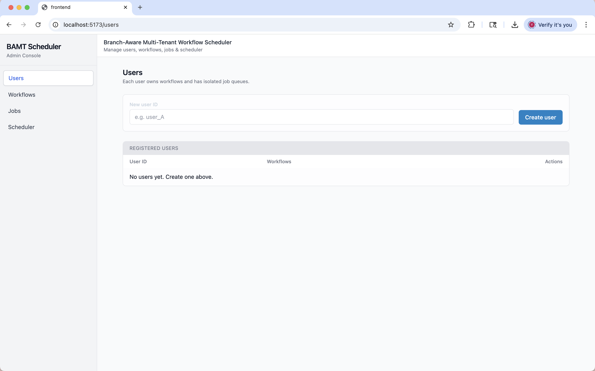
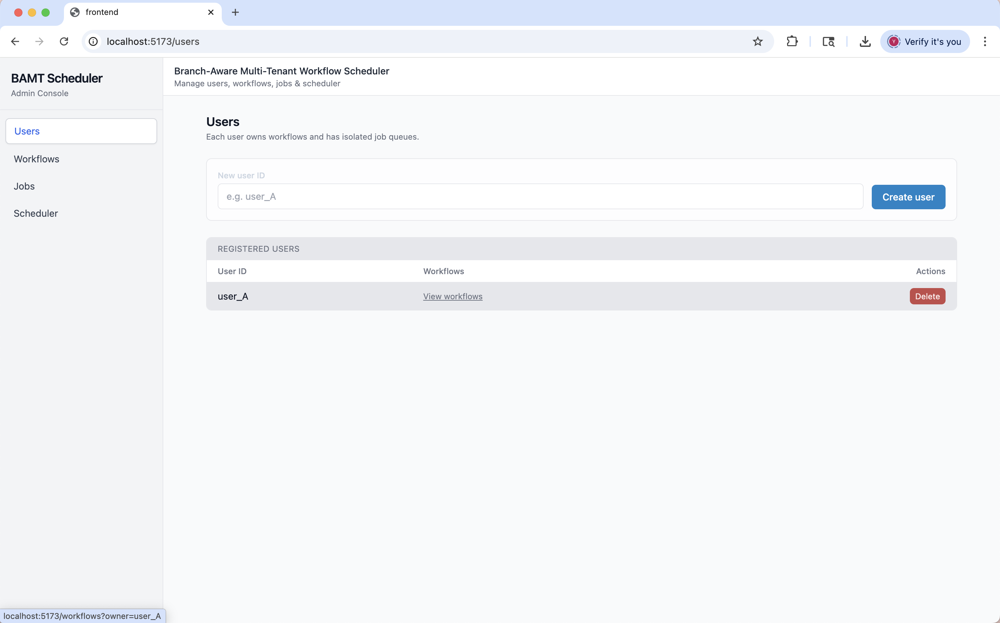
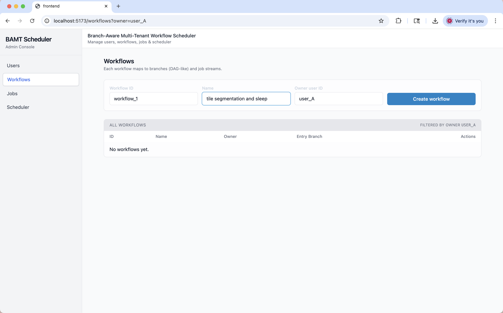
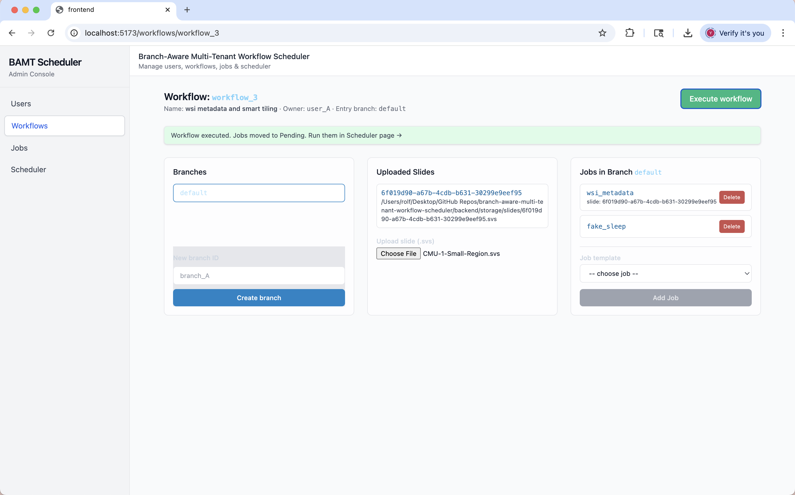
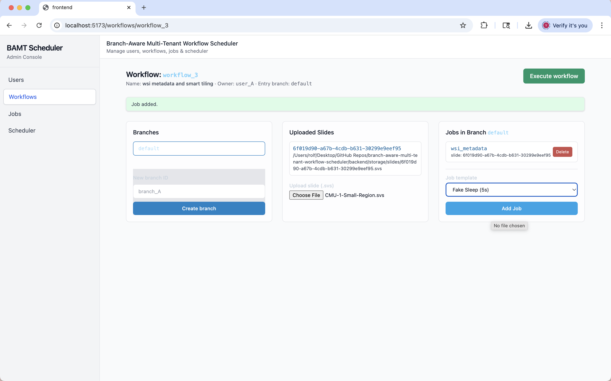
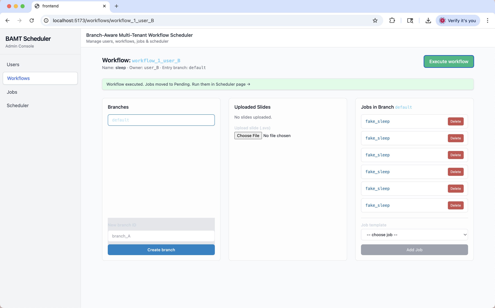
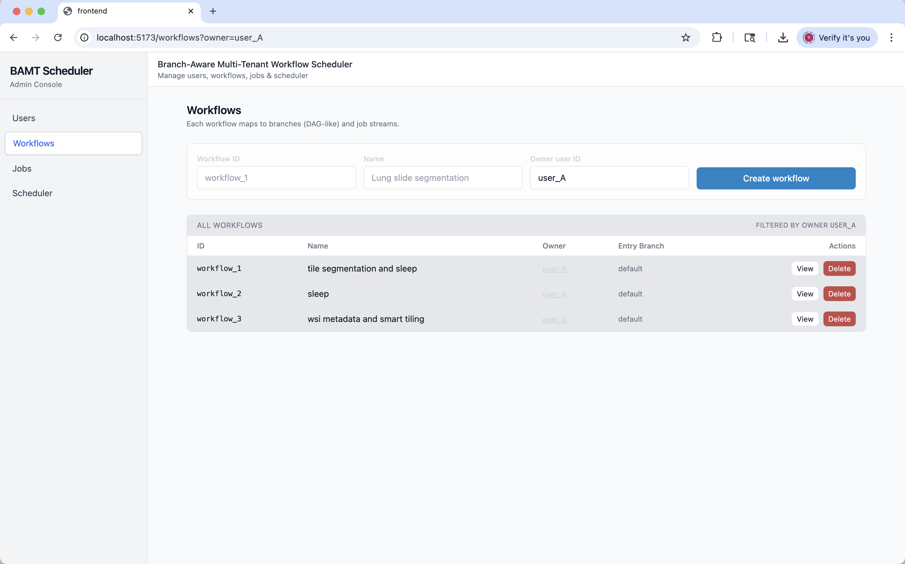
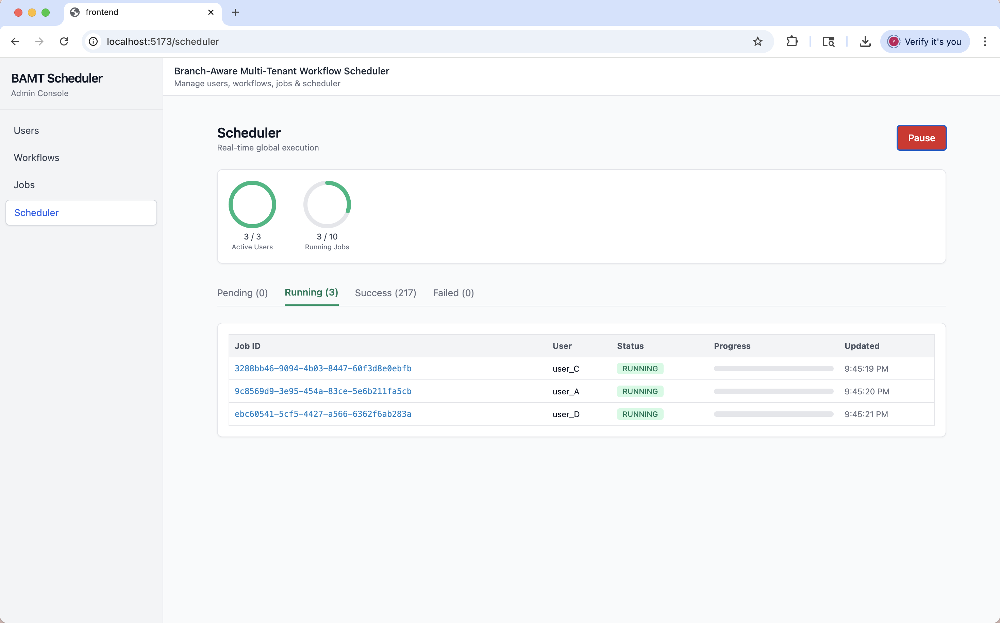
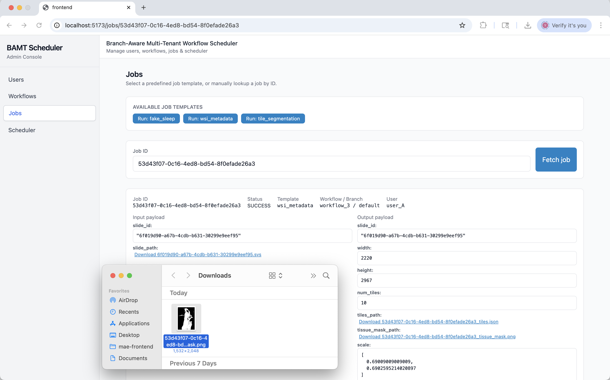
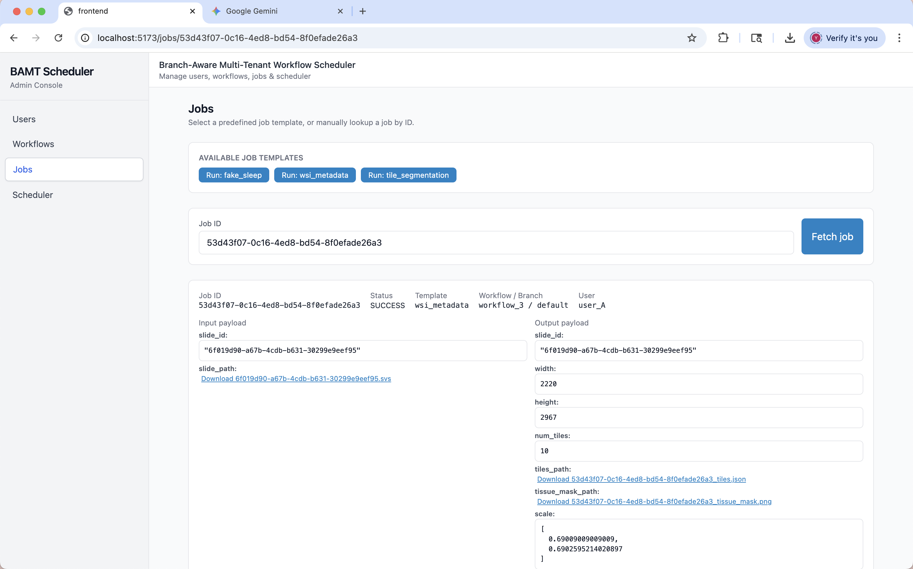

### Branch-Aware Multi-Tenant Workflow Scheduler

An asynchronous workflow shceduler for large-scale Whole Slide Image(WIS) Analysis. The system orchestrates InstanSeg inference tasks with multi-tenant isolation, branch-serial execution logic, and global concurrency controls on active users / parallel jobs execution.

#### Setup & Installation

Prerequisites:

- Python: `3.10.16`
- Node.js: `v20`

Detailed setup instructions for the backend and frontend are located in their respective subfolder:

1.  Backend Setup: [backend/README.md](./backend/README.md)
2.  Frontend Setup: [frontend/README.md](./frontend/README.md)

#### API Documentation

Once backend server is running, interactive API documentation (Swagger) is available at: http://localhost:8000/docs

This documentation includes all endpoints, redis schemas, result exporting, and more.

#### Scaling Strategy

The current architecture relies heavily on Redis for state management, locking, and queueing. Whileperformant for current small constraint, I suggest scaling to 10x would require 1) distributed database layer, move persistent state (job logs, user history) to relational databases while keeping Redis focusing on hot-path queueing and short-term locking; 2) load balancing, distribute traffic across multiple backend servers to further parallelize jobs; 3) horizontal worker scaling, as the current concurrency handling is limited by single-node pool, i would migrate workers to a container platform to scale worker pods horizontally; 4) GPU offloading and cloudcomputing, since it suits image processing tasks perfectly.

#### Key Optimizations & Benchmarks

The core of this challenge was to optimize the InstanSeg pipeline for gigapixel images. The naive and optimized local impalementations can be found in poc/jobs/process_wsi.py. The optimization details are shown as follows:

1. smart lazy loading: uses `openslide` to lazily load WSI metadata, precomputes tissue mask at low resolution to skip empty backgrounds.
2. adaptive tiling: slide is divided into fixed-size tiles with overlap
3. batch inference: Valid tissue tiles are aggregated into batches during InstanSeg processing.
4. output optimization: Results are merged into a global mask with overlap handling to prevent seam artifacts. Final visualizations are downsampled using OpenSlide thumbnail logic rather than manual resizing.

Pipeline runtime were generally reduced from 52~30%. The implemented sample shows that:

| Method                 | Time (Seconds) | Improvement       |
| :--------------------- | :------------- | :---------------- |
| **Naive Processing**   | 200.79 s       | -                 |
| **Optimized Pipeline** | **114.87 s**   | **~42.8% Faster** |

Processed sample WSIs:

#### Demo Screenshots

User Management

User Workflow / Branch Management

Workflow Generation

Branch Management for user, orchestrating Jobs with Uploaded .svs:

Branch Management for user, orchestrating Jobs:

Orchestrated Branch:

Workflow Management (Admin):

Scheduler with MAX_USER with forth user queued:

Generated Tissue Masks:

Smart Tiler / WSI init output:

